<div align="center">


# ORACULUM · 命运的抉择

<p>隔空伸手，从流动的星河里拾起五张牌，<br>再听一位 Live2D 小魔女慢慢讲给你听。</p>

<p>
  <a href="https://oraculum-tarot.netlify.app"></a>
  <a href="https://github.com/shihshdh/oraculum-tarot/releases/latest"></a>
</p>
<p>
  
  
  
  
  
</p>

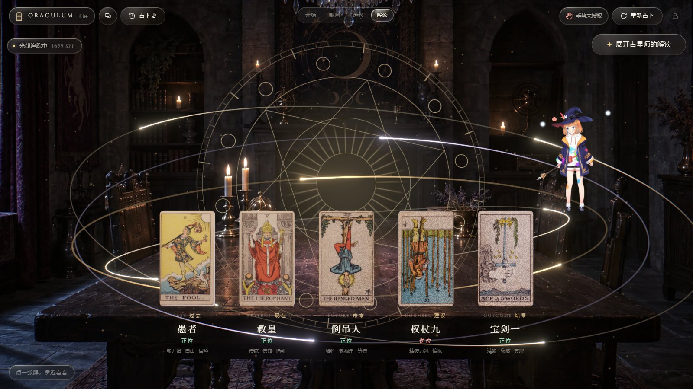

<sub>客户端截图。一间烛光摇曳的古堡占卜室，五张牌悬在长桌上方，身后的星盘法阵在半空中缓缓转动。翻牌后显卡用路径追踪把牌阵重新算了一遍，牌面的光泽和描金边的反光都是一根根光线追出来的。</sub>

</div>

<br>

起初只是想做一个"不用鼠标也能抽牌"的小玩意：打开摄像头，食指当光标，拇指和食指一捏，就把牌从星河里拿出来。后来越做越多，牌变成了有厚度、会反光的烫金卡片，解读交给了一个会看牌、会说话、会做表情的占星师，最后还给它做了一个把显卡跑满的桌面版。

牌面用的是 1909 年初版 Rider–Waite–Smith 的扫描，78 张一张不少。

## 怎么玩

1. **默问**：心里想着一个问题，写下来也行，不写也行。
2. **唤醒牌组**：点一下桌上的那副牌，牌会一张张打着旋从牌堆顶飞起来，像扇面一样向两边展开，在空中连成一条牌河；身后的星盘法阵随之点亮。
3. **拾牌**：牌河在头顶缓缓流过。停在一张牌上，它会慢下来等你；点一下，或者隔空捏一下，它就飞进下方的卡位。依次是过去、现在、未来、建议、结果。觉得手气不对，就把鼠标或手快速左右晃几下，重新洗一遍牌。
4. **翻牌**：五张到齐，牌会像波浪一样依次翻开。
5. **听她说**：占星师托起水晶球，边凝视边把解读一句句讲出来。字会从一点金色星光里一个个亮起来。讲完还可以接着追问，比如"哪张牌最关键？"。
6. **凑近看看**：点任意一张翻开的牌，它会从桌上浮起来飞到你眼前，旁边写着它在牌阵里的位置和含义。

手势只是锦上添花。没有摄像头，用鼠标或者手机轻点也完全能玩。

<table>
  <tr>
    <td width="50%">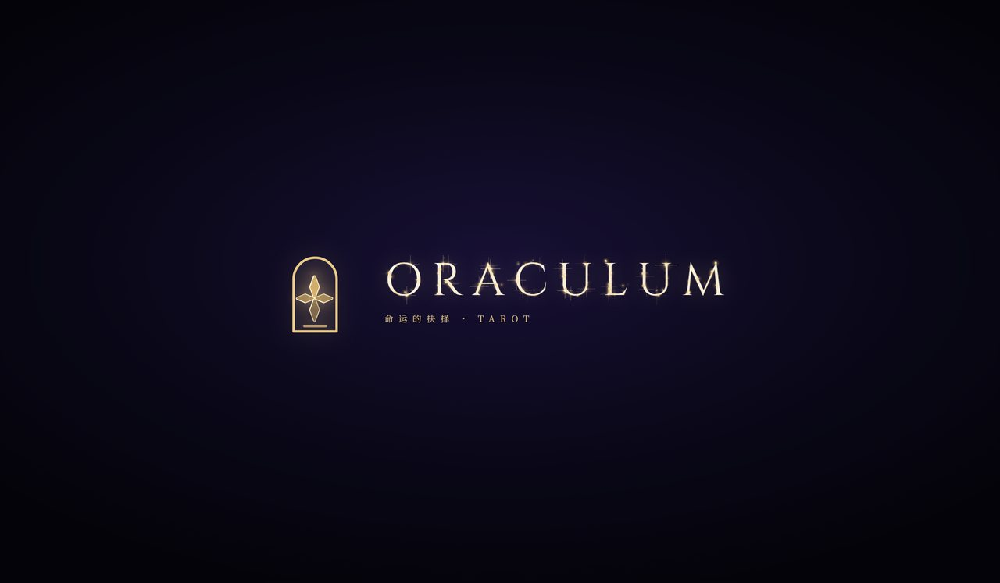</td>
    <td width="50%">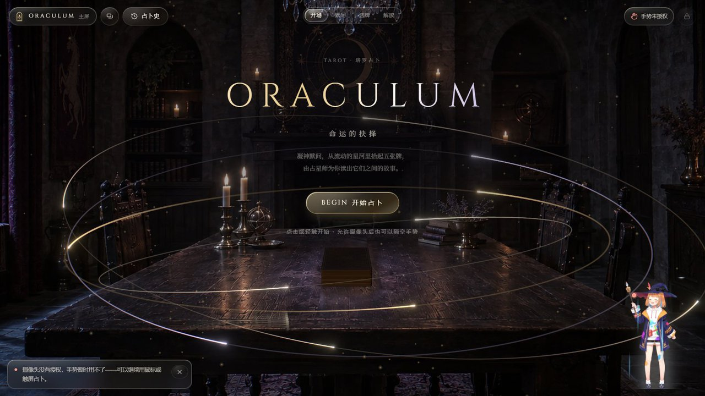</td>
  </tr>
  <tr>
    <td><b>开场</b><br>四片液态玻璃从屏幕四角飞来，拼成标志，字标一个字母一个字母浮上来。</td>
    <td><b>首页</b><br>一间从一张照片"像素重构"出来的 3D 占卜室：烛火在摇曳，移动指针就能轻轻转头看看四周。桌上那副牌，就是等下要用的牌。</td>
  </tr>
  <tr>
    <td>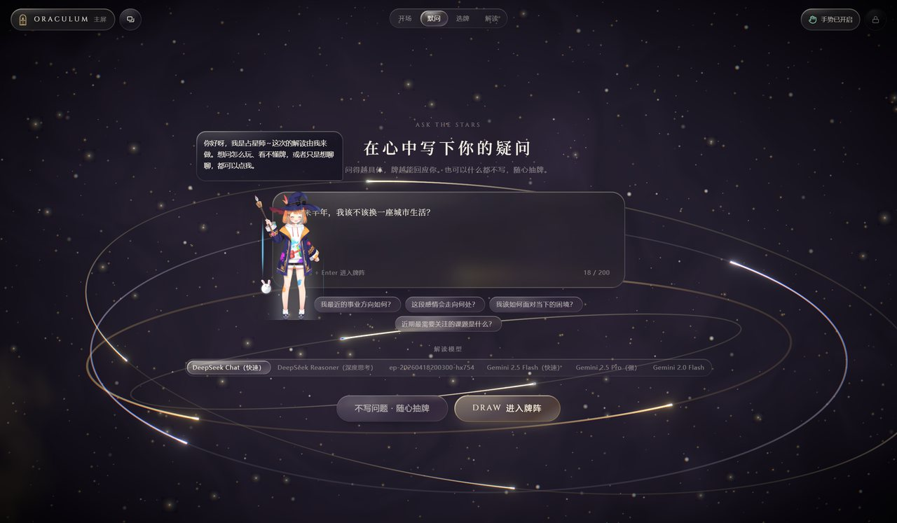</td>
    <td>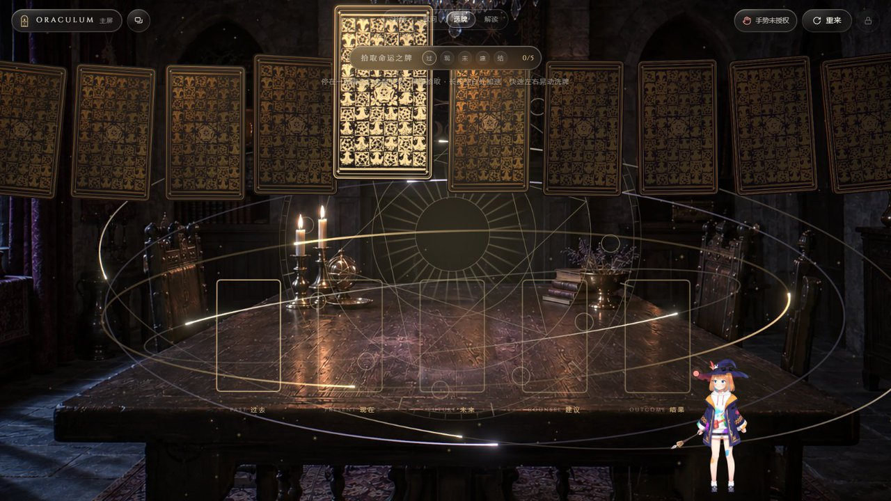</td>
  </tr>
  <tr>
    <td><b>默问</b><br>问得越具体，牌越能回应你。也可以什么都不写，随心抽。</td>
    <td><b>拾牌</b><br>牌背是初版的"蔷薇与百合"花纹，重新配成了夜蓝底烫金。客户端里会有一道流光扫过烫金。</td>
  </tr>
</table>

<p align="center">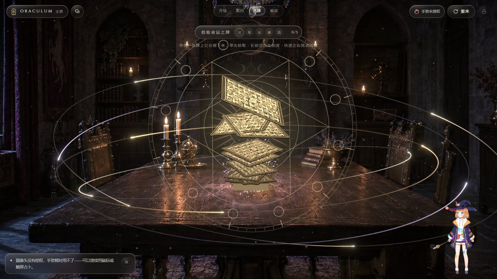</p>
<p align="center"><sub>点开牌组的那一秒：牌从牌堆顶一张张被掀起，打着旋升到空中，再向两侧扫开落进牌河。桌面被飞起的牌照亮。</sub></p>

## 藏在里面的小机关

<table>
  <tr>
    <td width="50%">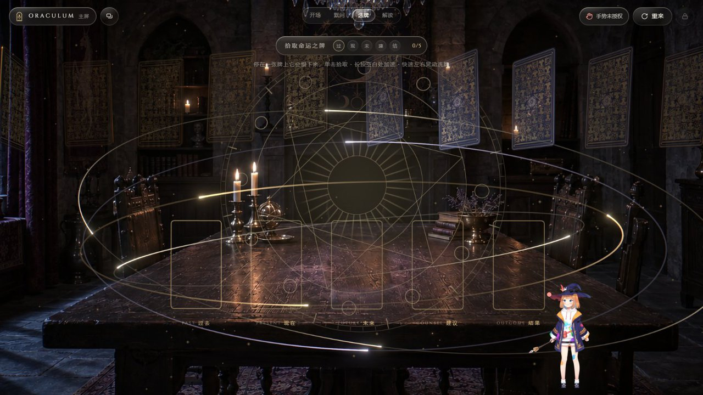</td>
    <td width="50%">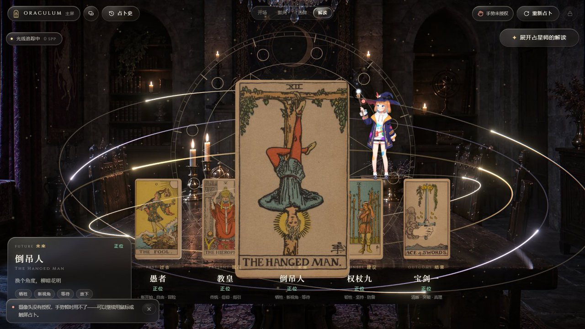</td>
  </tr>
  <tr>
    <td><b>洗牌</b><br>选牌时把鼠标或手快速左右晃几下，牌河会猛地转一圈，牌一张张旋转着淡出、换好顺序再淡入，还会扬起一阵金色光尘。占星师会夸你洗得好。</td>
    <td><b>凑近看看</b><br>翻牌之后点一张牌，它会沿一道弧线浮到眼前，跟着你的指针微微偏头。左下角写着它的位置、正逆位、关键词和一句话含义。点任意处或按 Esc 放回。</td>
  </tr>
</table>

- **牌河有"磁性"**：指针靠近时，附近的几张牌会微微抬起、朝你偏过来，离得越近越明显。
- **收牌**：点"重来"或"重新占卜"，空中的牌会一张张飞回桌上，翻回背面叠好，牌堆一层层长回原来的厚度。
- **手势全程可用**：上面这些操作，隔空捏合和挥手都能完成。

## 占星师

右下角那个戴尖帽子的小魔女，是这个站的另一半灵魂。

- **解读由她来做**。翻牌后她会托起水晶球，解读流式写出来的时候她在开口说话，说完按牌面的气氛做表情，偶尔还会变个小魔法：放个治愈爱心，或者召唤一只兔子，也可能失手冒一团烟。
- **可以随时找她聊**。不懂怎么玩、看不懂某张牌，直接问。她能看到页面上有什么按钮，可以帮你点、帮你打开面板；重置、删除这类操作会先问你。
- **会留意你卡住的地方**。摄像头没授权、解读失败，她会主动过来问要不要帮忙。
- 在手机上她默认收成一个小胶囊，点开才加载形象，不拖慢页面。

## 桌面客户端

网页版要照顾手机和各种浏览器，画面必须收着点。客户端就不用客气了：它直接用你电脑上的独立显卡，把能开的效果都开了。

| | 网页版 | 客户端 |
| --- | --- | --- |
| 分辨率 | 屏幕原生 | 至少 1.5 倍超采样 |
| 抗锯齿 | 4× MSAA | 8× MSAA |
| 占卜室 | 照片重构的 3D 房间、烛火、重新打光、桌面倒影 | 同左，环境反射 1024 分辨率 |
| 流光 | — | 烫金牌背上扫过的光带，环绕牌阵流动的四条光轨 |
| 光追 | — | 翻牌后用 GPU 路径追踪重新渲染牌阵 |

<table>
  <tr>
    <td width="50%">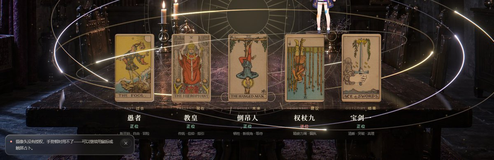</td>
    <td width="50%">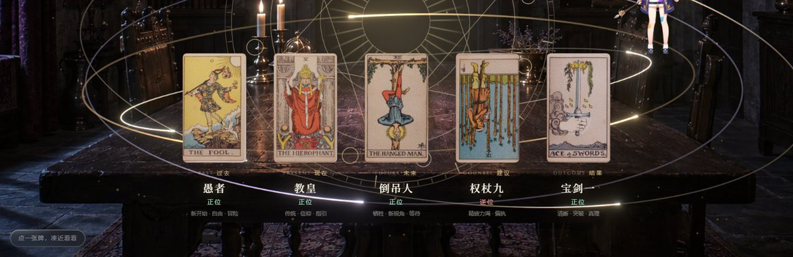</td>
  </tr>
  <tr>
    <td><b>翻牌那一刻</b>：实时渲染。</td>
    <td><b>几十秒后</b>：路径追踪在一层层累积采样。牌面覆膜有了真实的高光和柔和的明暗，描金边有了金属光泽，牌与牌之间还会互相映照。</td>
  </tr>
</table>

光追第一次启动时要先编译着色器，大概二三十秒，左上角会显示进度。攒够 2000 次采样（一两分钟）后它会自己停下，不再占着显卡。

**下载**：到 [Releases](https://github.com/shihshdh/oraculum-tarot/releases/latest) 下载 zip，解压后双击 `ORACULUM.exe`。需要 Windows 10/11 64 位，最好有独立显卡。

- 占卜记录和缓存默认存在 `D:\ORACULUM\data`；没有 D 盘时存到系统默认位置，也可以用环境变量 `ORACULUM_DATA` 指定。
- 快捷键：`F11` 全屏，`Esc` 退出全屏，`F5` 刷新。
- AI 解读需要联网。

## 手机上

<p align="center">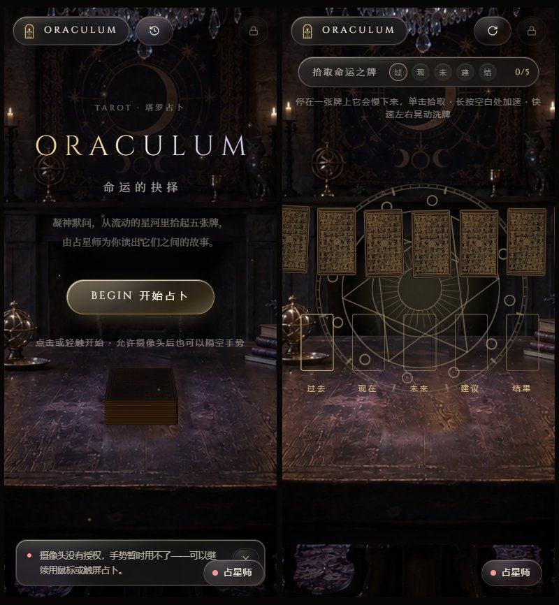</p>

手机版在 [oraculum-tarot.netlify.app](https://oraculum-tarot.netlify.app)。国内网络不用代理也能打开。手机上不会申请摄像头，3D 画面按手机显卡的预算来画；在支持全屏的浏览器上，第一次轻触会自动全屏。iPhone 上可以"添加到主屏幕"，从桌面图标打开就是全屏。

## 它是怎么搭起来的

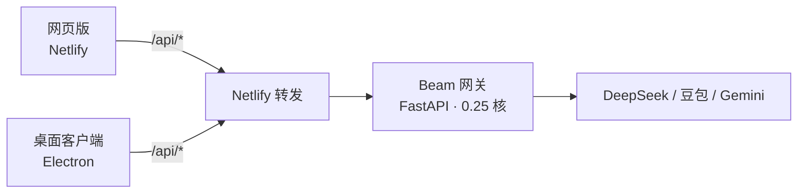

- **前端**：React + react-three-fiber。牌是带厚度和圆角的描金卡片，星盘、粒子都在 GPU 上画。手势识别放在 Web Worker 里跑，不和 3D 抢时间。
- **占卜室**：一张照片，用 [Depth Anything V2](https://github.com/DepthAnything/Depth-Anything-V2) 估出每个像素的深度，再按照片里那副牌的透视反推出镜头的俯角和高度（误差不到 1 像素），标定成真实的尺度。顶点着色器把每个像素推回它在 3D 里的位置、在 GPU 上重建法线；星盘和牌是真的光源，会照亮桌面和墙面；沿桌面镜像镜头再画一遍牌阵，就是漆面上的倒影。镜头只能在拍摄位置轻轻转头，可转的范围按屏幕比例实时算出，不会转到照片外面去。生成脚本在 `scripts/build-room.py`。
- **后端**：Beam 上的一个小 FastAPI，没人访问时缩到 0 个容器，不花钱。提示词在服务端拼好，API Key 不会离开服务器。网页和客户端都经 Netlify 转发，所以国内也能访问。
- **客户端**：Electron 用自定义协议 `oraculum://` 提供打包在本地的页面，强制使用独立显卡。特效由构建开关 `VITE_EDITION=desktop` 打开，网页版打包时这些代码会被整段剔除。光追用的是 [three-gpu-pathtracer](https://github.com/gkjohnson/three-gpu-pathtracer)。

## 自己跑起来

```bash
npm install
npm run dev              # 网页版，http://localhost:5173/?role=main
npm run desktop:dev      # 客户端，直接用 Electron 打开
npm run desktop          # 打包客户端并安装到 D:\ORACULUM（Windows）
```

AI 解读需要自己的模型 Key：本地启动后，从右上角的锁形按钮进入管理员面板填写。管理员密码用环境变量 `ADMIN_PASSWORD` 设置，不设置的话每次启动随机生成一个，打印在终端里。

更细的开发、部署和运维笔记在 [docs/DEVELOPMENT.md](docs/DEVELOPMENT.md) 和 [DEPLOY.md](DEPLOY.md)。

## 致谢与许可

- **牌面与牌背**：1909 年 Rider–Waite–Smith "Roses & Lilies" 初版扫描，来自 [Wikimedia Commons](https://commons.wikimedia.org/wiki/Category:Rider-Waite_tarot_deck_(Roses_%26_Lilies))，公有领域。牌背是在原图花纹上重新配色的。
- **桌面木纹**：Poly Haven 的 [Lacquered Cherry Wood](https://polyhaven.com/a/lacquered_cherry_wood) 扫描材质（颜色、法线、粗糙度贴图），CC0。
- **占星师形象**：Live2D 官方示例模型「Mao」，出自 [CubismWebSamples](https://github.com/Live2D/CubismWebSamples)，按 [Live2D Free Material License](https://www.live2d.com/eula/live2d-free-material-license-agreement_cn.html) 原样使用，详见 `public/companion/mao/LICENSE-Live2D.md`。
- **Live2D Cubism Core**：Live2D Inc. 的专有软件，按其再分发条款提供。
- **手势识别**：[MediaPipe](https://developers.google.com/mediapipe) Hand Landmarker。
- 塔罗解读只是一面镜子，帮你换个角度看看自己的处境。真正的决定，还是交给你自己。
